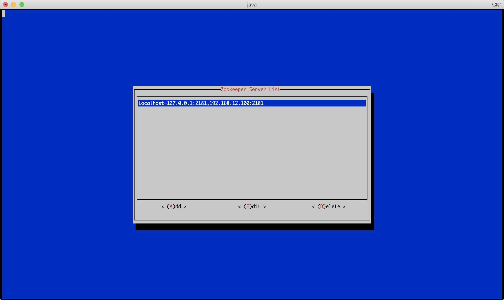
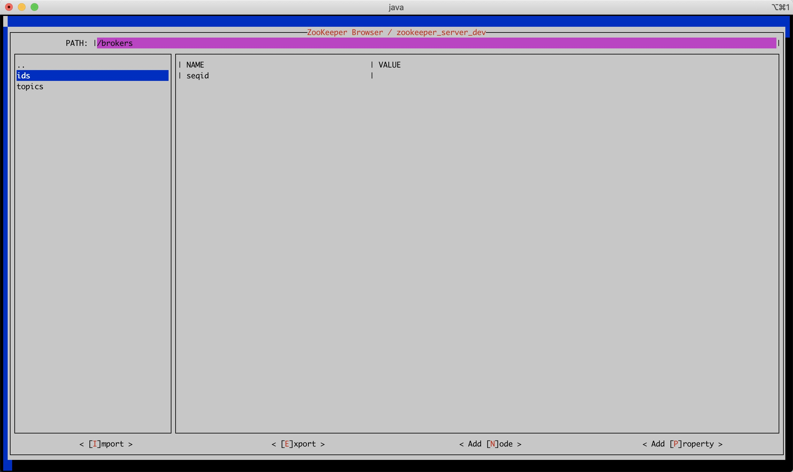
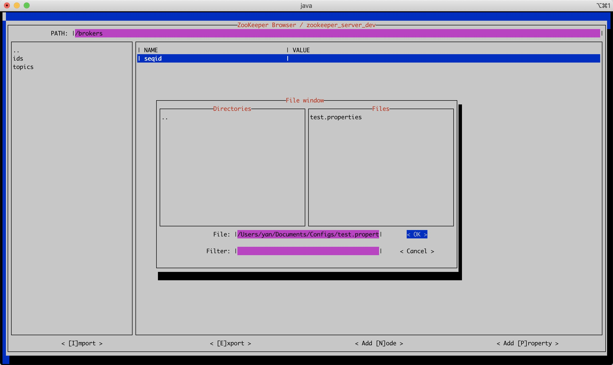
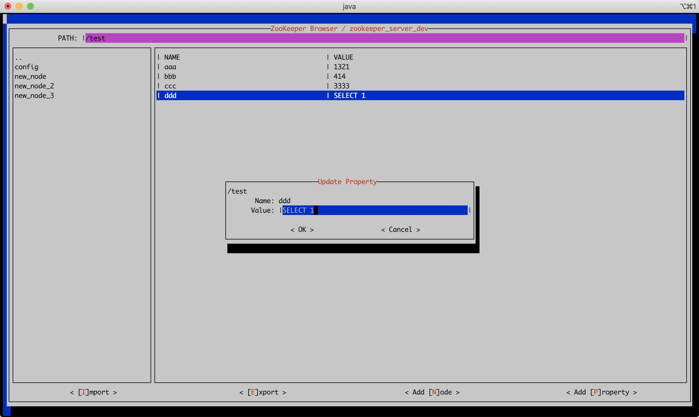
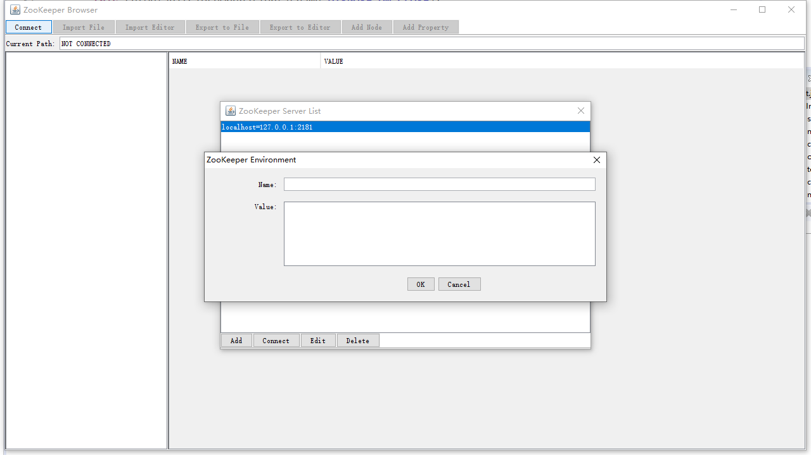
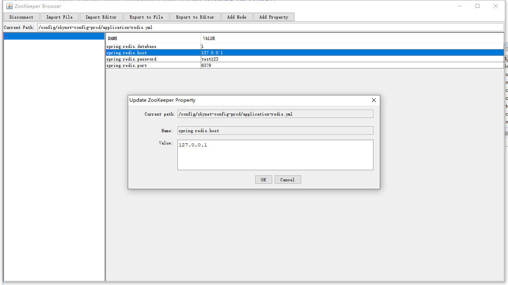
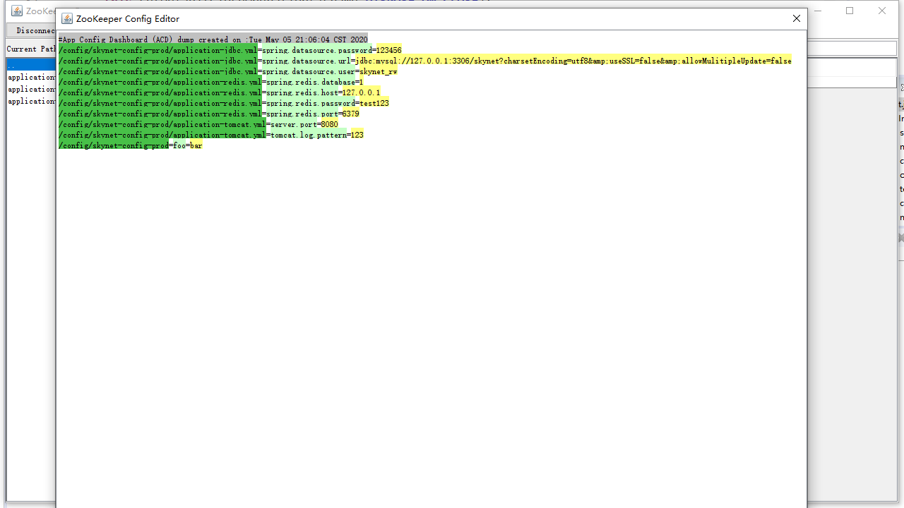

# ZooKeeper XUI

This is both GUI and TUI for ZooKeeper client. The TUI is developed upon jcurses, while the GUI is based on SWING.

For some reason I can't use [DeemOpen/zkui](https://github.com/DeemOpen/zkui) on a CentOS  server. And I have lots of configurations stored on ZooKeeper. So I wrote this tool to edit ZooKeeper on server.

## Screenshots

